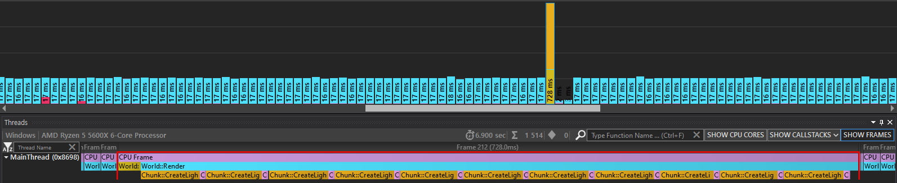
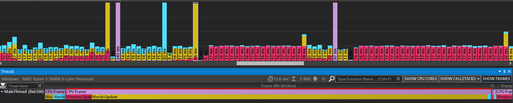
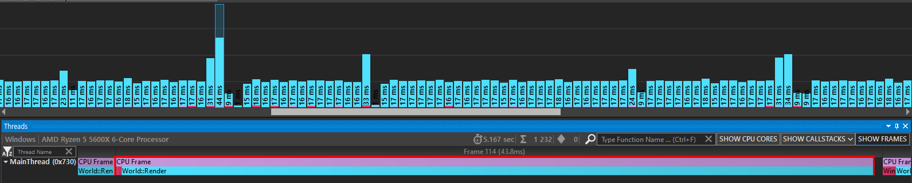

# NaezanCraft
MineCraft Copy Naezan's Engine

- How to build using CMake(Testing)
  - 
    - git clone
  ```shell
  git clone https://github.com/Meizoa/NaezanCraft.git
  ```

    - Build (Find the folder where "CMakeList.txt" exists)
  ```shell
  mkdir WhatYouWantBuildDirectory
  cd WhatYouWantBuildDirectory
  cmake ..
  cmake --build .
  #Only Debug is possible, later add Release Build, maybe?
  ```

    - git command
  ```shell
  git status -> current git status like new file, modified, deleted etc..
  git add * -> register current status
  git reset . -> reset add *
  git commit -m "Text What You Want" -> commiting..
  git push origin main -> push to main branch
  ```

- TO DO List
  - 
    - [x] ~~Create Rectangle~~
    - [x] ~~Create RenderBuffer & RenderShader~~
    - [x] ~~Create Camera & Player~~
    - [x] ~~프러스텀컬링(AABB)~~
    - [ ] 오컬루전 컬링 + 옥트리(조금 더 추가적인 연산을 필요로 하기에 적절하게 써야함)
    - [x] ~~Chunk Object Rendering~~
    - [x] ~~블럭 방향에 따라 다른 텍스처 로드~~
    - [x] ~~SkyBox~~
        * ~~Sun & Moon~~
        * ~~Cloud~~
    - [ ] Map Generator
        * ~~Render Chunk When Player Move~~
        * ~~청크 랜덤 블록 렌더링~~
        * 세이브 로드 청크, 월드(SaveWorld, LoadWorld, SaveChunk, LoadChunk)
        * ~~World Objects(like tree, catus etc..)~~
        * 그리디 메싱 + 비등방성문제
        * *Instancing(메모리관리 후 검토)*
        * *BSP(Maybe Cave? or Town? but i am not implement cave and town)*
        * *Region Weather System(later if possible)*
    - [x] ~~Lighting~~
        * ~~Ambient Occlusion(+라이트컬링)~~
        * ~~Sun Light~~
        * ~~Object Light(Flood fill Algorithm)~~
        * *레이 트레이싱*
        * *DotProduct*
    - [?] ECS
    - [?] Object Pool(*다른 사이드 프로젝트로 할까 생각중*)
    - [x] ~~Collision~~
        * ~~레이케스트~~(reference : https://github.com/cgyurgyik/fast-voxel-traversal-algorithm/blob/master/overview/FastVoxelTraversalOverview.md)
        * ~~delete and emplace Block~~
        * *(AABB-> OOBB, 내가 이전에 사용한 AABB방법을 이용하려면 엔티티 컴포넌트 시스템을 이용했어야 했다 하지만 이번 프로젝트에선 ECS를 사용하지 않을 것이기때문에 AABB나 OBB가 적절하지 않아 보였다. 그럼에도 다른방법으로 사용할 수 있다는것을 알고있고 고려해볼만한 사항이라고 생각해두고 있다.)*
        * *(쿼드 트리 -> 옥트리, 청크 기반 충돌을 사용했다 옥트리를 사용하고 싶었지만 적절하진 않았다)*
    - [?] AI(Too Much, if i can, i do)
        * A* or JPS
        * 브레젠험
        * FSM(상태머신)

- BUG
  - 
    - [x] ~~16 * 16 Chunk is 15 * 15 Chunk~~
    - [x] 새로운 청크가 생성될때 Face면 리로드
    - [ ] 새로운 청크가 생성될때 SSAO 리로드
    - [x] ~~라이팅 맵 생성중 프레임 드랍 발생~~
      

    - [x] ~~최적화중에 CPU가 Lock에 의해서 많은 시간 놀고있는것을 발견했다 아마 스레드분리하는 곳에서 문제가 발생했고 그 문제를 해결하기 위해서 유사 싱글 스레드를 사용하였다. 그리고 OpenGL에서는 스레드를 지원해주지 않기때문에 분리해서 처리해줘야한다.~~
      
    - [x] ~~청크경계면에 블럭을 설치할때 fatal error 발생, 메모리릭이 있는듯하다~~
    - [x] ~~SSAO의 렌더링이 다음 블럭 설치까지 딜레이가 생긴다~~

- 현재 최적화 상태
  