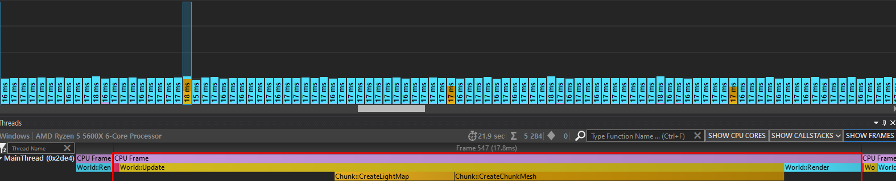

# NaezanCraft
MineCraft Copy Naezan's Engine

Here is Short Video : https://youtu.be/dMamwtB50Rc

- How to build using CMake
  - 
    - git clone
  ```shell
  git clone --recursive https://github.com/Naezan/NaezanCraft.git
  ```

    - Build (Find the folder where "CMakeList.txt" exists)
  ```shell
  mkdir Build
  cd Build
  cmake ..
  cmake --build .
  #Only Debug is possible, Release is not supported
  ```

    - git command
  ```shell
  git status -> current git status like new file, modified, deleted etc..
  git add * -> register current status
  git reset * -> reset all added git
  git commit -m "Text What You Want" -> commiting..
  git push origin main -> push to main branch
  ```

- Feature
  - 
    - Chunk Rendering
    - Different block face rendering
    - SkyBox & WorldTime Lighting
    - Frustum Culling
    - Thread Base Procedural Map Generator
    - Ambient Occlusion(SSAO)
    - Water Animation
    - Flood fill algorithm for Sun Shadow
    - Thread Base Save(Serialization) And Load(Deserialization) Chunk
    - Simple Inventory
    - Gravity
    - Thread Base BGM & Sound
    - Collision
    - Raycasting
    - Installing and removing blocks

- TO DO List (Since 2023-01-19) 연제 구현할지 정확히 계획되지 않음
  - 
    - [ ] VertexCoord의 position 2바이트로 최적화
    - [ ] 오컬루전 컬링
    - [ ] *Water Physics*
    - [ ] *BSP(Maybe Cave? or Town? but i am not implement cave and town)*
    - [ ] *Region Weather System(later if possible)*
    - [ ] *Object Light(Flood fill Algorithm)*
    - [ ] Fog
    - [ ] AI
        * A* or JPS
        * 브레젠험
        * 비헤비어 트리

- Reference
  * SkyBox & Shader and more : https://github.com/Aidanhouk/Minecraft-Clone
  * Sun Shadow : https://codepen.io/xgundam05/pen/nydzXE?editors=100
  * SSAO의 비등방성 문제 : https://0fps.net/2013/07/03/ambient-occlusion-for-minecraft-like-worlds/
  * SSAO의 비등방성 문제 : https://bbtarzan12.github.io/Voxel-Part-3/
  * 직렬화 라이브러리 : https://github.com/eyalz800/serializer
  * 직렬화 코드 참조 : https://github.com/codingminecraft/StreamMinecraftClone
  * 크로스헤어 : https://manmohanbishnoi.wordpress.com/2014/12/02/2d-hud-graphics-over-3d-objects-in-modern-opengl/
  * 레이케스트 알고리즘 : https://github.com/cgyurgyik/fast-voxel-traversal-algorithm/blob/master/overview/FastVoxelTraversalOverview.md

- 현재 최적화 상태
  